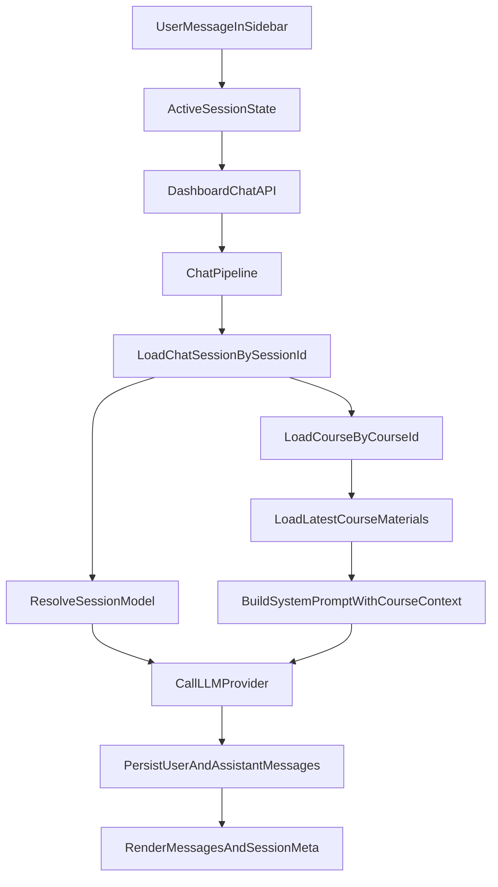

# AI聊天模块优化计划

## 目标与约束
- 优化工作台右侧 AI 聊天模块，形成可用的课程上下文聊天闭环。
- 明确并落地聊天会话数据模型，支持：新建、查看历史、重命名、硬删除、会话级模型切换。
- 保持 AI 调用入口统一，避免在 UI 层分散调用模型 API。
- 你已确认的实现选择：
  - 模型切换粒度：**每个会话固定模型（per-session）**
  - 删除策略：**硬删除（删除会话及其消息）**

## 现状结论（用于指导改造）
- 右侧栏已有“新建会话 + 切换会话 + 发送消息”，缺少重命名/删除入口：[`E:/Workbench/毕设/ailearn/components/dashboard/right-sidebar.tsx`](E:/Workbench/毕设/ailearn/components/dashboard/right-sidebar.tsx)
- 聊天核心链路已统一到 pipeline：[`E:/Workbench/毕设/ailearn/lib/chat-pipeline.ts`](E:/Workbench/毕设/ailearn/lib/chat-pipeline.ts)
- 课程上下文目前由 `session.courseId` 实时查询课程资料并注入 system prompt：[`E:/Workbench/毕设/ailearn/lib/course-context.ts`](E:/Workbench/毕设/ailearn/lib/course-context.ts)、[`E:/Workbench/毕设/ailearn/lib/chat-course-context.ts`](E:/Workbench/毕设/ailearn/lib/chat-course-context.ts)
- 模型配置当前主要来自环境变量，不是请求级/会话级驱动：[`E:/Workbench/毕设/ailearn/lib/ai.ts`](E:/Workbench/毕设/ailearn/lib/ai.ts)

## 分阶段实施

### 阶段 1：会话模型与接口契约收敛
- 检查并固定 `ChatSession` 模型职责：
  - `courseId`：会话所属课程上下文
  - `model`：会话固定模型（本次核心字段）
- 若 `model` 字段语义不完整，补充 Prisma 约束与默认策略（迁移可选，优先最小改动）。
- 统一右侧栏会话 API 契约（建议集中在 [`E:/Workbench/毕设/ailearn/app/api/dashboard/chat/route.ts`](E:/Workbench/毕设/ailearn/app/api/dashboard/chat/route.ts) 或拆分子路由）：
  - `POST` 新建会话（支持初始模型）
  - `GET` 列表与指定会话详情
  - `PATCH` 重命名 / 切换模型
  - `DELETE` 硬删除会话（级联消息）

### 阶段 2：右侧栏会话管理能力补齐
- 在 [`E:/Workbench/毕设/ailearn/components/dashboard/right-sidebar.tsx`](E:/Workbench/毕设/ailearn/components/dashboard/right-sidebar.tsx) 增加会话操作入口：
  - 新建会话（保留）
  - 历史会话查看与切换（保留并增强）
  - 会话重命名（新增交互）
  - 会话删除（新增确认交互，执行硬删除）
- 切换会话后确保消息列表与当前会话模型状态同步更新。

### 阶段 3：会话级模型切换落地
- 在右侧栏增加“当前会话模型”选择器（仅作用于当前 session）。
- 在服务端将模型选择写入 `ChatSession.model`，并由 pipeline 实际读取该字段驱动 AI 调用：
  - 改造 [`E:/Workbench/毕设/ailearn/lib/chat-pipeline.ts`](E:/Workbench/毕设/ailearn/lib/chat-pipeline.ts)
  - 改造 [`E:/Workbench/毕设/ailearn/lib/ai.ts`](E:/Workbench/毕设/ailearn/lib/ai.ts) 使其支持外部传入 model（仍保留 env 默认值兜底）
- 约束可选模型白名单（避免前端任意字符串直传）。

### 阶段 4：课程上下文与资料联动可解释化
- 保持“按会话课程实时查库”的上下文注入方式，不引入额外缓存复杂度。
- 在聊天返回中增加轻量元信息（可选）：当前上下文课程名/资料数量/模型名，用于前端可视化提示。
- 明确“新增资料是否自动生效”：通过实时查库保证后续消息自动纳入新资料。

### 阶段 5：输出 AI 功能介绍（你要求的说明）
- 产出一份面向业务/答辩的说明文档（建议新增到 `docs` 目录）：
  - 如何让 AI 聊天基于课程上下文
  - 如何让 AI 会话基于课程资料（并明确新增资料会自动进入后续上下文）
  - 大模型 API 放置位置、应用调用链路、输入输出与展示方式
- 说明文档将以“架构概览 + 调用时序 + 关键文件映射”组织，确保可直接复用到汇报材料。

## 数据流示意（优化后）

## 验收标准
- 右侧 AI 聊天支持：新建、历史查看、切换、重命名、硬删除。
- 会话级模型切换生效：同一用户不同会话可使用不同模型。
- 聊天上下文稳定绑定课程：会话按 `courseId` 实时拉取资料；新增资料在后续消息自动纳入上下文。
- AI 调用入口仍统一在服务端 AI 模块，前端不直接调用外部模型 API。
- 交付一份完整的 AI 聊天功能说明文档，覆盖你提出的三类解释要求。