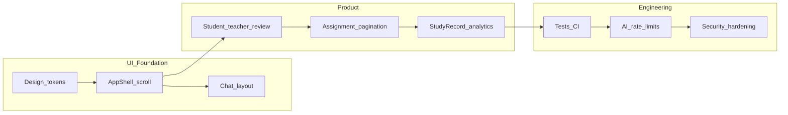

# UI 设计优化 + 工业级开发计划

## 现状与问题（基于代码）

| 维度 | [DESIGN.md](e:\Workbench\毕设\ailearn\DESIGN.md) 要求 | 当前实现（主要来源） |
|------|----------------------|------------------------|
| 色彩 | 黑 / `#f5f5f7` 交替，**仅** Apple Blue `#0071e3` 作交互强调 | [app/globals.css](e:\Workbench\毕设\ailearn\app\globals.css) 使用 `#f3f5f9`、多灰阶；[components/layout/app-shell.tsx](e:\Workbench\毕设\ailearn\components\layout\app-shell.tsx) 导航激活态为 **emerald**（第二强调色） |
| 字体 | SF Pro Display/Text 与光学字号边界 | [app/layout.tsx](e:\Workbench\毕设\ailearn\app\layout.tsx) 使用 **Geist**，与 DESIGN 不一致 |
| 布局宽度 | 内容区约 **980px**，全宽仅用于 hero/分节 | `max-w-[1600px]` 三栏 + 主区内再 `max-w-5xl` 等，视觉尺度不统一 |
| 顶栏 | 深色半透明玻璃 + blur | 浅色 `border-b` + `backdrop-blur`，气质与规范不同 |
| 滚动 | 通过分节色块与留白控制节奏，避免杂乱长滚 | 全局三栏 + 主区 `min-h-[78vh]`（[app-shell.tsx](e:\Workbench\毕设\ailearn\components\layout\app-shell.tsx)、[chat-app.tsx](e:\Workbench\毕设\ailearn\components\chat\chat-app.tsx)）易产生 **整页滚动 + 内部滚动条** 叠加；教师课程页（[teacher course page](e:\Workbench\毕设\ailearn\app\(teacher)\teacher\courses\[courseId]\page.tsx)）单页表单+列表过长，「内容过多难看滚动」 |

结论：问题不仅是「美丑」，而是 **设计 token 未落地**、**壳层布局与 DESIGN 叙事冲突**、**缺少单一滚动轴与信息分区策略**。

---

## 一、UI / 布局 / 样式优化方案（严格对齐 DESIGN.md）

### 1. 设计 Token 层（先做，再改组件）

在 [app/globals.css](e:\Workbench\毕设\ailearn\app\globals.css)（或新增 `app/design-tokens.css` 并由 `layout` 引入）定义与设计文档一致的 CSS 变量，例如：

- 表面：`--surface-hero-dark: #000000`、`--surface-section-light: #f5f5f7`、文本 `--text-primary-light-bg: #1d1d1f`
- 交互：**唯一** `--interactive-blue: #0071e3`、链接 `--link-blue: #0066cc`、暗底链接 `--link-blue-on-dark: #2997ff`
- 间距：以 **8px** 为基数的 scale（DESIGN 第 5 节）
- 圆角：5 / 8 / 11 / 12 / 980px pill（DESIGN 5 节 Border Radius）
- 阴影：仅 elevated 卡片使用 `rgba(0,0,0,0.22) 3px 5px 30px 0`（DESIGN 6 节），默认平面

字体：Next 无法合法托管 SF Pro；采用 **系统字体栈** 贴近 DESIGN（`ui-sans-serif, system-ui, -apple-system, BlinkMacSystemFont, "SF Pro Text", ...`），display 级标题用 `font-semibold` + DESIGN 规定的字号/行高/字距类（可用 Tailwind `@layer utilities` 封装 `.type-display-hero` 等）。

**必须删除或替换**：全站用于「主 CTA / 激活态」的 **emerald** 等非蓝色强调（与 DESIGN「Don't」冲突），改为蓝或中性底对比。

### 2. 应用壳（AppShell）重构策略

目标：**减少噪音、统一宽度语义、消灭多余滚动**。

建议拆分为两种布局（路由组或条件渲染，尽量少分支）：

1. **营销 / 落地页壳**（可选）：首页 `/`、登录注册可用 **全宽分节**（黑 / 浅灰交替），无左右「占位」栏，符合 DESIGN「Product Hero」节奏。
2. **应用工作台壳**（`/teacher`、`/student`、`/chat`）：  
   - **不要** 默认三栏 + 固定「提示面板」；改为 **顶栏 + 单主列**（max-width 980px 居中），次要帮助用 **抽屉 / 折叠面板 / 页脚链接** 收纳。  
   - 顶栏：实现 DESIGN 导航条（`rgba(0,0,0,0.8)` + `backdrop-filter: saturate(180%) blur(20px)`），Logo + 少量主导航 + 用户菜单；**去掉**「左栏/右栏」切换按钮或改为移动端 drawer。  
   - 若保留侧边栏：仅 **左侧**、宽度固定（如 240px），且 **不参与** 与主区双重纵向滚动（侧栏 `overflow-y-auto` + `max-h-screen` 内收）。

### 3. 单一滚动轴（解决「难看滚动」的核心工程）

采用经典 **sticky header + flex 列 + min-h-0** 模式：

```text
html, body, #root-shell { height: 100%; }
#app { min-h-screen; display: flex; flex-direction: column; }
header { flex-shrink: 0; }
main { flex: 1; min-height: 0; overflow-y: auto; }  /* 仅此区域纵向滚动 */
```

- 移除或降低主内容 arbitrary `min-h-[78vh]` 与多层 `min-h-full` 的堆叠；子页面用 **`flex-1 min-h-0`** 承接。  
- **聊天页**（[components/chat/chat-app.tsx](e:\Workbench\毕设\ailearn\components\chat\chat-app.tsx)）：整页为 `h-[100dvh]`（或 `100svh`）布局；**消息列表**单独 `flex-1 overflow-y-auto`；输入区 `shrink-0`；会话历史若展开，限制高度或改为侧滑，避免 `max-h-44` 与整页滚打架。视觉改为与 DESIGN 一致的 **暗 hero + 蓝交互**（当前 `#212121` + emerald 需调整）。

### 4. 信息密度与长页（教师课程详情等）

以 [app/(teacher)/teacher/courses/[courseId]/page.tsx](e:\Workbench\毕设\ailearn\app\(teacher)\teacher\courses\[courseId]\page.tsx) 为代表：

- 用 **Tabs / 分步表单** 拆分：「作业」「资料」「成员概览」分标签，每屏只呈现一块任务。  
- 列表区：**分页或虚拟滚动**（与下文工业级计划一致），卡片用 DESIGN 的浅/深表面与克制阴影。  
- 成功/错误提示：统一为 toast 或顶栏下 **inline banner**（短文案），避免多段彩色条堆叠拉长页面。

### 5. 组件层收敛

- 建立小型 **设计系统组件**：`Button`（Primary Blue / Primary Dark / Pill Link）、`PageHeader`、`Section`（交替背景）、`Card`，全部读 token，避免页面内随手 `border-zinc-*`。  
- 审计 [components/ui](e:\Workbench\毕设\ailearn\components\ui) 与页面内联 class，按 DESIGN 5–7 节做对照表逐项替换。

### 6. 可访问性与交互细节（DESIGN + 工业级交集）

- 所有可聚焦控件：`outline` / `focus-visible` 使用 `--interactive-blue`（DESIGN 6 节 Focus）。  
- 尊重 `prefers-reduced-motion`：减弱 [globals.css](e:\Workbench\毕设\ailearn\app\globals.css) 中 `button:hover` 的 `translateY` 对敏感用户的影响。

---

## 二、工业级标准：项目开发计划（产品 + 工程）

以下阶段可按团队体量并行，但建议顺序：**数据与权限正确 → 核心闭环体验 → 可观测与质量闸门 → 安全与合规**。

### 阶段 A — 文档与契约一致

- 统一 [AGENTS.md](e:\Workbench\毕设\ailearn\AGENTS.md) 与真实栈：当前为 **SQLite**（[prisma/schema.pr若](e:\Workbench\毕设\ailearn\prisma\schema.prisma)），避免后续协作误判。  
- API / Server Action：**统一** `{ success, data?, error? }` 与 **zod** 校验（AGENTS 要求）；对现有 route 做清单审计。

### 阶段 B — 产品完整度（对齐 [README.md](e:\Workbench\毕设\ailearn\README.md)「下一步」并扩展）

1. **教师审核结果学生端可见**：读 `StudyRecord.meta.teacherReview`，学生作业详情页展示状态（待审 / 通过 / 驳回）、评语与时间线。  
2. **作业提交列表**：筛选、按学生/时间排序、**分页**（Prisma `skip/take` + cursor 更佳）。  
3. **课程学习分析面板**：基于 `StudyRecord` 聚合（提交率、平均分建议分布、最近活动）；导出 CSV 可选。  
4. **空状态与引导**：每类列表统一 [EmptyState](e:\Workbench\毕设\ailearn\components\ui\empty-state.tsx) 文案 + 主 CTA（创建课程 / 加入课程）。  
5. **全局反馈**：用统一 toast/sonner 类库或自研轻量方案替代仅依赖 URL `searchParams` 提示与 [FlashNotice](e:\Workbench\毕设\ailearn\components\ui\flash-notice.tsx) 的混合体验。

### 阶段 C — 工程质量

- **测试**：关键业务用例（注册登录、加课、交作业、AI 初评 demo 路径、教师审核）— **Playwright** E2E；`lib/authz`、`lib/course-access`、纯函数用 **Vitest**。  
- **CI**：GitHub Actions（或等价）跑 `lint`、`typecheck`、`test`、`next build`。  
- **错误边界**：路由级 `error.tsx` 细化；Server Action 错误映射为用户可读文案 + 日志 id。

### 阶段 D — AI 与成本（工业级运行）

- [lib/ai.ts](e:\Workbench\毕设\ailearn\lib\ai.ts) 外再包一层：**限流**（每用户/每课程）、**超时与重试**、**token 预算**、结构化日志（不含密钥与全文 PII）。  
- 作业初评：结果 schema 校验失败时的降级策略与重试提示。

### 阶段 E — 安全与运维

- 密码与 session：审查 bcrypt 轮数、session 过期与轮换、`SESSION_SECRET` 长度提示。  
- 文件上传：类型与大小白名单、存储路径不暴露、病毒扫描（若部署到公网）。  
- 生产：`next start` / 容器、环境变量管理、数据库备份（SQLite 迁移到托管 DB 时的迁移脚本预留）。

### 阶段 F — 可选增强

- 邮件验证 / 找回密码、站内通知、多语言、管理员角色与审计日志。

---

## 三、建议实施顺序（执行时）

1. **Token + 滚动架构**（globals + AppShell + Chat 布局）— 收益最大、风险可控。  
2. **替换强调色与顶栏** — 快速统一「像 DESIGN」。  
3. **教师课程页信息架构**（Tabs + 列表分页）— 直接解决长滚与杂乱。  
4. **README 三项产品缺口** — 闭环与「友好度」。  
5. **测试 + CI + AI 限流** — 工业级底线。



---

## 四、关键文件清单（实施时优先改动）

- [app/globals.css](e:\Workbench\毕设\ailearn\app\globals.css) — 变量与基础排版  
- [components/layout/app-shell.tsx](e:\Workbench\毕设\ailearn\components\layout\app-shell.tsx) — 壳层与滚动  
- [components/chat/chat-app.tsx](e:\Workbench\毕设\ailearn\components\chat\chat-app.tsx) — 聊天区高度与滚动  
- [app/(teacher)/teacher/courses/[courseId]/page.tsx](e:\Workbench\毕设\ailearn\app\(teacher)\teacher\courses\[courseId]\page.tsx) — 长页拆分  
- [app/page.tsx](e:\Workbench\毕设\ailearn\app\page.tsx)、[app/(auth)](e:\Workbench\毕设\ailearn\app\(auth)) — 落地与认证页分节视觉  
- 新建 `components/ui/*` 原子组件 — 收敛样式

本计划不修改你已附的 plan 文件内容；实施时按上列顺序迭代即可。
