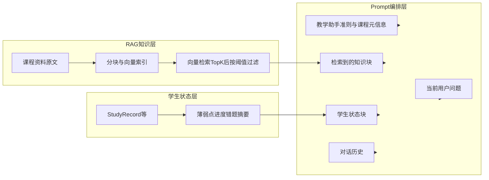

# 基于课程上下文的 AI 聊天模块优化计划

## 现状：模型如何「记住」上下文

当前实现不是长期记忆模型参数，而是 **每次请求组装 messages**：

| 层级 | 机制 | 代码位置 |
|------|------|----------|
| 会话绑定课程 | `ChatSession.courseId` 关联课程 | [`lib/chat-pipeline.ts`](e:/Workbench/毕设/ailearn/lib/chat-pipeline.ts) |
| 课程静态上下文 | 查询课程及全部 `LearningMaterial`，排序后格式化为一大段文本，作为 **首条 system**，长度上限约 24k 字符截断 | [`lib/chat-course-context.ts`](e:/Workbench/毕设/ailearn/lib/chat-course-context.ts)、[`lib/course-context.ts`](e:/Workbench/毕设/ailearn/lib/course-context.ts) |
| 对话短期记忆 | 取最近约 40 条 `ChatMessage` 拼进 `messages` | [`lib/chat-pipeline.ts`](e:/Workbench/毕设/ailearn/lib/chat-pipeline.ts)、[`lib/ai.ts`](e:/Workbench/毕设/ailearn/lib/ai.ts) `buildMessagesForApi` |

结论：**「记住」= system 里的课程资料块 + 对话历史**；资料是全量（截断）注入，**没有做语义检索**，也未把学生错题/掌握度结构化注入。

---

## 目标架构（最小模块化）

将单次回复前的上下文拆成三块，由 **Prompt 编排层** 拼成一条或多条 system/user 结构（建议保持 `messages` 兼容现有 OpenAI 协议调用）：

编排后的逻辑结构对应你给出的模板（实现时可合并为 1～2 条 `system`，避免超出供应商消息条数限制）：

- `[System Prompt]`：角色 + 课程标题/说明 + 回答边界（沿用并提炼 [`buildCourseGroundedSystemPrompt`](e:/Workbench/毕设/ailearn/lib/course-context.ts) 的行为准则）
- `[学生状态]`：从状态层读取的短摘要（弱点、进度、近期错题要点）
- `[检索到的知识]`：RAG 返回的 Top-K 片段（带资料标题/序号）
- `[用户问题]`：仍为当前用户消息（最后一轮 user）

---

## 阶段 1：Prompt 编排层（不动向量库也可先落地）

- 新增模块（建议）：[`lib/chat-prompt-orchestrator.ts`](e:/Workbench/毕设/ailearn/lib/chat-prompt-orchestrator.ts)  
  - 输入：`coursePayload`（或精简元数据）、`ragSnippets[]`、`studentStateSummary`、`userQuestion`（用于检索的一句话）  
  - 输出：组装后的 **单一结构化字符串** 或「system 分段」约定，供 [`generateAssistantReply`](e:/Workbench/毕设/ailearn/lib/ai.ts) 使用。
- 调整 [`lib/ai.ts`](e:/Workbench/毕设/ailearn/lib/ai.ts)：将「一条巨型 `buildCourseGroundedSystemPrompt`」改为调用编排函数；**HTTP 调用仍只留在 `lib/ai.ts`**（符合 [`AGENTS.md`](e:/Workbench/毕设/ailearn/AGENTS.md) 集中调用约定）。
- 调整 [`appendUserMessageAndGetAssistantReply`](e:/Workbench/毕设/ailearn/lib/chat-pipeline.ts)：在调用 `generateAssistantReply` 之前注入编排结果（可先 `ragSnippets=[]`、`studentState=null` 打通结构）。

验收：即便 RAG/状态层未就绪，聊天行为与现网等价或仅有 prompt 文案微调。

---

## 阶段 2：RAG 层（嵌入式向量库 — **方案 B**）

**选型（固定）**：采用 **嵌入式向量库**（进程内或本地文件持久化），例如 **LanceDB** 或 **Chroma**（均为本地存储、无独立服务端进程亦可部署）。Prisma/SQLite 仅存 **chunk 元数据与业务外键**；向量与相似度检索在向量库内完成，便于 Top-K 与阈值过滤。

**原则**：「分块 + 嵌入写入向量库 + 检索」；嵌入模型可配置；索引与 [`LearningMaterial`](e:/Workbench/毕设/ailearn/prisma/schema.prisma) 写入/更新挂钩。

### 1. 数据模型与关联

- Prisma 表 `CourseKnowledgeChunk`（示例字段）：`id, courseId, materialId?, sourceKind, chunkIndex, content, createdAt`（**不设 embedding 大字段**，避免 SQLite BLOB 膨胀）。  
- 向量库中每条记录：**向量** + **chunkId**（及可选 `courseId` 用于命名空间过滤）。Upsert/删除时与 Prisma 同一事务顺序或先 DB 后向量库补偿删除，避免悬空索引。

### 2. 写入路径

- 资料创建/更新后：分块 → 调用嵌入 API → **upsert** Prisma chunk + 向量库（[`app/dashboard/actions.ts`](e:/Workbench/毕设/ailearn/app/dashboard/actions.ts) 等写入 `LearningMaterial` 处挂钩）。

### 3. 检索路径与 **相似度阈值（必须写清）**

1. 对用户当前问题（或轻量 query 重写）做 **query embedding**。  
2. 在向量库内按课程过滤：`courseId == session.courseId`，检索 **Top-K**（如 K=20，优先召回候选）。  
3. **阈值过滤**：对每个候选计算与 query 的相似度得分（与所选库一致：多为 **cosine similarity**，范围通常 \\([0,1]\\) 或需归一化后对比）。**仅保留 `score >= minSimilarity` 的 chunk** 进入 `[检索到的知识]`；低于阈值的 chunk **丢弃**，不注入 Prompt（避免「勉强相关」噪声）。  
4. **上限**：阈值通过后还可按 `maxSnippets` / `maxChars` 截断，防止 Prompt 过长。  
5. **配置**：`minSimilarity`、`topK`、`maxChars` 建议环境变量或统一常量（如 `RAG_MIN_SIMILARITY`、`RAG_TOP_K`），文档与代码注释中写明：**阈值越高，片段越少但越相关；阈值过低则近似 Top-K 全用**。

### 4. 降级策略

- **无嵌入服务 / 未建索引 / 阈值过滤后为空**：回退为现有「截断全量资料」或关键词/BM25 子集，保证可用；可在 meta 中标记 `ragMode: fallback`。

验收：同一课程下，相关提问仅注入高相似片段，token 明显下降；故意偏离课程的提问在阈值下可能得到较少或无 RAG 片段，触发降级而不胡编章节。

---

（以下为旧方案对比备忘：**不再采用方案 A**「仅存 SQLite + 应用侧全量余弦」作为主路径；若向量库临时不可用，运行时仍可退回类似 A 的简化路径作为应急。）

---

## 阶段 3：状态层（学生进度 / 错题 / 掌握度）

**最小做法**：优先 **聚合现有 [`StudyRecord`](e:/Workbench/毕设/ailearn/prisma/schema.prisma)**（作业提交、批改、`meta.aiReview`、聊天 `AI_SESSION` 等），生成一段 **固定格式的短摘要** 注入 `[学生状态]`。

若聚合不足以支撑「错题列表、掌握度」：

- **增量表（可选）** `StudentCourseProfile`：`userId, courseId, weakTopics Json?, mastery Json?, updatedAt`  
  - 由作业批改、测验结果异步或同步更新；聊天只读该摘要。

验收：学生账号下聊天能看到与个人相关的弱点提示；教师账号可不注入或注入班级摘要（按角色分支在 pipeline 内处理）。

---

## 阶段 4：串联与观测

- 在 [`StudyRecord`](e:/Workbench/毕设/ailearn/prisma/schema.prisma) 或聊天 `meta` 中可选记录：`retrievalChunkIds`、`promptVersion`，便于答辩演示与排错。
- 单元测试：编排函数纯字符串组装；检索模块 mock embedding。

---

## 风险与边界

- **Token 上限**：RAG + 学生状态 + 历史仍需总控；编排层应对 `[检索到的知识]` 单独设 `maxChars`。
- **向量库与嵌入**：嵌入调用集中在 [`lib/ai.ts`](e:/Workbench/毕设/ailearn/lib/ai.ts) 或独立 `lib/embeddings.ts`；向量库初始化与阈值常量集中在 `lib/rag-*` 一类模块，不把业务散落在 UI。
- **权限**：学生状态仅当前 `userId`；课程检索范围仅限 `session.courseId`。

---

## 建议实施顺序（最小闭环）

1. Prompt 编排接口 + pipeline 接入（结构先行）  
2. 资料分块 + 嵌入式向量库写入；检索为「Top-K → 相似度阈值 → 注入」（阈值不足则降级）  
3. 学生状态摘要（先聚合 StudyRecord，再考虑新表）  
4. 观测与降级策略固化  
